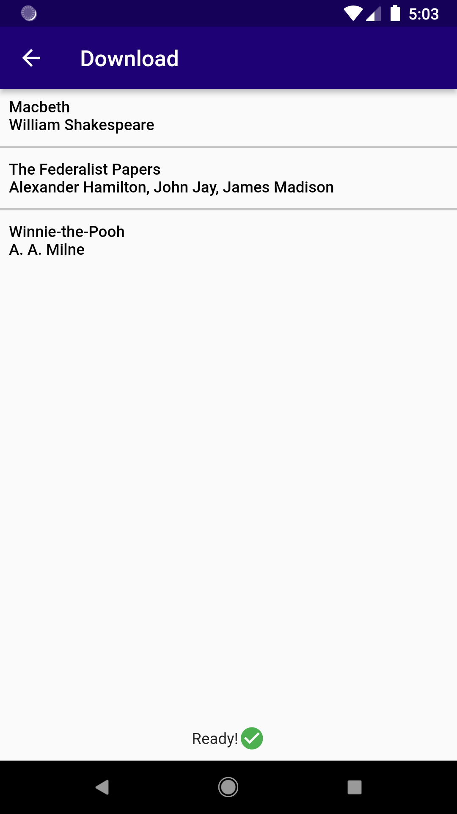
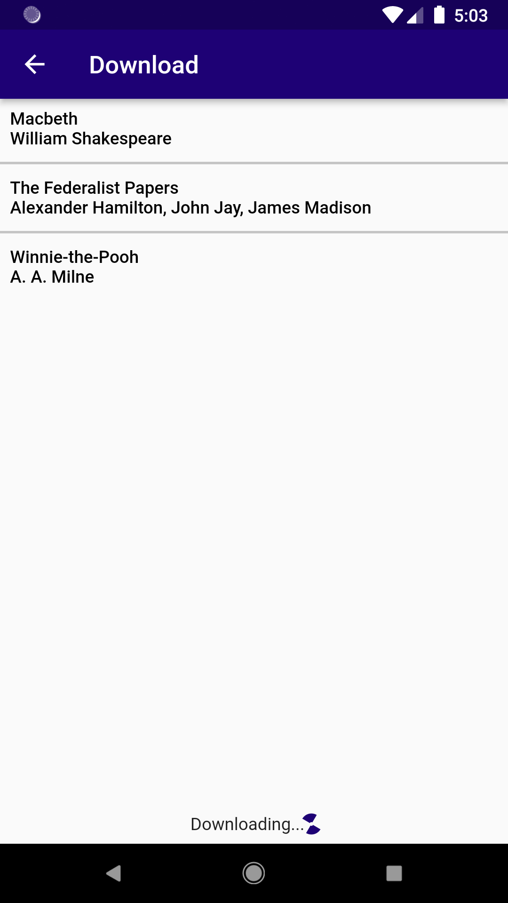

# Thali eReader - Flutter app

This is an eReader app. It not only allows you to read ebooks, but it allows deep customization to make books as easy to read as possible, including customizing the font size, background color, font color, margins, and more.

It is named for [Thalia](https://en.wikipedia.org/wiki/Thalia_(Muse)), the Greek Muse of comedy and idyllic poetry.

This is a general overview of how to use it. **To learn how it interacts with the server, check out the [ebook-server](https://github.com/TheOmnimax/ebook-server) repository.** For the app used to upload new ebooks, check out the [Ebook uploader](https://github.com/TheOmnimax/ebook_uploader).

Currently, only EPUB files are supported, but this may change in the future.

**Table of contents**
 * [About](#about)
 * [Add ebook](#add-ebook)
 * [Open ebook](#open-ebook)
 * [Delete ebook](#delete-ebook)
 * [Change style](#change-style)
 * [Add new style](#add-new-style)
 * [Create and sign into account](#create-and-sign-into-account)
 * [Download new ebook](#download-new-ebook)
 * [Future updates](#future-updates)

## About

This app was built using Flutter. It is meant to work as an Android app. It could hypothetically work as an iOS app, but that has not been tested.

## Add ebook

|  |
|:--:|
| Use three-dot menu to add ebook |

You can download your own ebook EPUB file, and then open it using the app.

1. Download an EPUB file to your device.
1. In Thali, tap the three-dot menu in the upper-right, then *Add book*.
1. If the app asks for permission to access files on your device, tap *Allow*.
1. Select the EPUB file.

The new ebook should appear immediately, but if it does not, tap the refresh button in the upper-right.

## Open ebook

|  |  |  |
|:--:|:--:|:--:|
| Home screen | Reading ebook | Turning page |

From the main menu, simply tap the book you would like to open, and it will open. Swipe from right-to-left to turn the page.

## Delete ebook

|  |
|:--:|
| Delete ebook |

Simply tap the three-dot button to the right of the ebook, tap *Download*, then tap *Delete* at the popup.

## Change style

|  |
|:--:|
| Select style |

You can change the style of the books you read, including the font color, background color, and more.

1. Tap the three-dot menu in the upper-right, then *Select style*.
1. At the bottom, select the style you would like to use. You can preview it at the top. Which ever style you choose is the style that will be applied in the ebooks you read.

To move, edit, or delete a style, tap the three-dot menu to the right of the style, and tap the requested action.

## Add new style

|  |  |  |  |
|:--:|:--:|:--:|:--:|
| Style options | Add style | Edit colors | Edit font size |

Thali comes with two styles, but you can also add your own.

It is often easier to start from an existing style. Simply tap the three-dot menu to the right of the style, then tap *Edit/Copy*, and the editor will open. To OVERWRITE an existing style, tap the *Name* module, and give it a different name. If you do not rename it, then it will overwrite the style with that name. Don't worry, it will warn you before you overwrite it!

To create a new style from scratch, from the *Select Style* menu, tap the three-dot menu in the upper-right, then *Add new style*.

## Create and sign into account

|  |  |  |
|:--:|:--:|:--:|
| Login drawer | Login page | Signed in |

|  |  |
|:--:|:--:|
| Register | Register error |

In order to download ebooks from the server, you need to have an account and sign in.

From the main menu, tap the three-line menu in the upper-left, then *Log in*. In the upper-right, there will be a *Register* button you can use to register for a new account. If you already have an account, simply enter your credentials and tap *Log in*.

## Download new ebook

|  |  |  |  |
|:--:|:--:|:--:|:--:|
| Loading | Download list | Downloading | Download complete |

While you can provide your own ebooks, you can also download ebooks by connecting to our server.

1. Tap the three-line menu in the upper-left.
1. If it says *Log in* at the top, tap it, and [log in](#create-and-sign-into-account).
1. Tap *Download*. Wait for the list of ebooks to load.
1. Tap the ebook you would like to download. The bottom of the screen will say "Complete!" when it is finished.
1. Use the *Back* button on your device to return to the main menu.
1. If the book does not appear in the main menu, tap the refresh button in the upper-right.

## Future updates

* Allow for more ebook file types.
* Enhance ebook display.
* Add more fonts